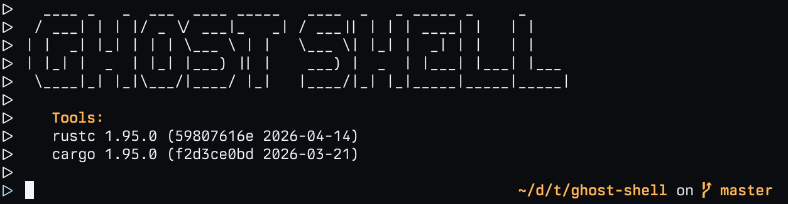

# Preview

## Motivation

System customization is one of my favorite aspects of Linux. The freedom of
choice that the Linux environment gives you is beyond imagination.

Over the last few years, I have tried many bars, launchers, and shell
environments, but none of them have really given me that inner satisfaction.
They are either incomplete, based on outdated technologies, or they are too
clunky and give you much more than you actually need.

In my ideal world, a shell environment should be small, efficient, and easy to
use. If extensions are needed, they should be easy and enjoyable to develop.

Ultimately, I decided that I should give building my own shell environment in
Rust a try. For the UI, I chose Zed's GPUI, which has proven to be an excellent
Rust UI library with minimal external dependencies.

For plugin development, I want to take inspiration from my beloved Helix Editor
project, I also want to embed the Steel Scheme interpreter and allow the shell
to be extended further using the Scheme language.

Right now, this is only the beginning, I do not have a strict deadline, and I
will commit to this repository whenever I have set and settings, beauty comes
from patience and joy.

## Roadmap

- Bar
  - Widgets
    - Start
      - OS menu
      - Niri workspaces
    - Center
      - Focused window
    - End
      - Notifications
      - Volume
      - Micorofone
      - Camera
      - Bluetooth
      - Wifi/Ethernet
      - Battery
      - Clock
- Launcher
- Lock screen

# Licensing

The code in this project is licensed under the MIT License. Check the
[LICENSE](LICENSE.md) file for further details.
