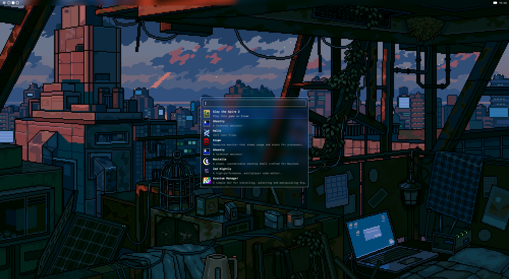

# Preview



## Motivation

System customization is one of my favorite aspects of Linux. The freedom of
choice that the Linux environment provides is beyond imagination. Over the last
few years, I have experimented with vairous bars, launchers, and shell
environments, but none of them really clicked with me. Ultimately, I decided to
try building my own shell environment in Rust. My personal goals are to improve
my Rust programming skills and explore new programming domains.

# Overview

Ghost Shell is a desktop shell built exclusively for the Niri Wayland
compositor. This project explores a combination of modern technologies intended
to produce a small and resource efficient shell environment. The project's name
is inspired by the anime Ghost in the Shell.

The project does not claim to be the best option on the market, nor does it aim
to become one. I simply want to build a good tool that I will enjoy using on the
daily basis. The project is currently in a very early stage of development, so
it is not yet ready for general use.

The current goal is to implement the following basic functionality:

- [ ] Bar
  - [ ] Widget: System Menu
  - [ ] Widget: Niri Workspaces
  - [ ] Widget: Focused Window
  - [ ] Widget: Tray
  - [ ] Widget: Notifications
  - [ ] Widget: Camera
  - [ ] Widget: Audio Control (Speakers/Microfone)
  - [ ] Widget: Bluetooth Control
  - [ ] Widget: Network Control (Wifi/Ethernet)
  - [ ] Widget: Power Control (Battery/CPU modes)
  - [ ] Widget: Clock
  - [ ] Widget: Screenshot & Screen recording
  - [ ] Widget: Theme Polarity Changer
  - [ ] Widget: Weather
- [ ] App Launcher
  - [ ] App Search
  - [ ] File Search
- [ ] Lock Screen
- [ ] Clipboard
- [ ] Wallpapers
- [ ] Theming

# Getting Started

## Prerequisities

Development is currently intended for NixOS systems. There are no plans to
support other systems at this time.

## Installation

Clone the repository:

```shell
git clone https://github.com/thatwhichisdev/ghost-shell
```

## Developing

To enter a development environment with all the necessary tools, run:

```shell
nix develop
```

## Building

```
cargo build  
```

## Running

```
cargo run   
```

## Configuration

Ghost Shell discovers its configuration according to the XDG Base Directory
Specification. I keep my configuration at `~/.config/ghost-shell/config.toml`.

Here is an example of the current configuration:

```toml
[general]
font_family = "BerkeleyMono Nerd Font Mono"
font_size = 13
fg = 0xffffffff
bg = 0x00000000

[bar."eDP-1"]
output = "eDP-1"
height = 27.0
exclusive_zone = 27.0

[bar."DP-1"]
output = "DP-1"
height = 27.0
exclusive_zone = 27.0

[clock]
format = "%H:%M"
```

# Licensing

The code in this project is licensed under the MIT License. Check the
[LICENSE](LICENSE.md) file for further details.
