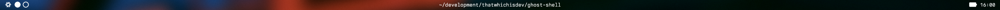
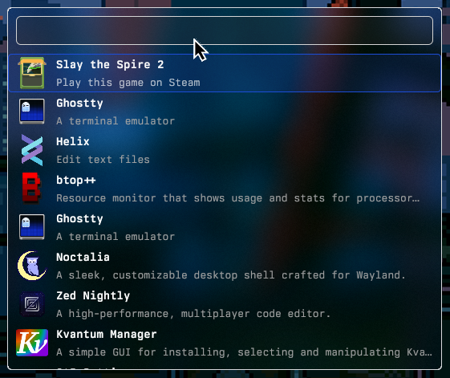
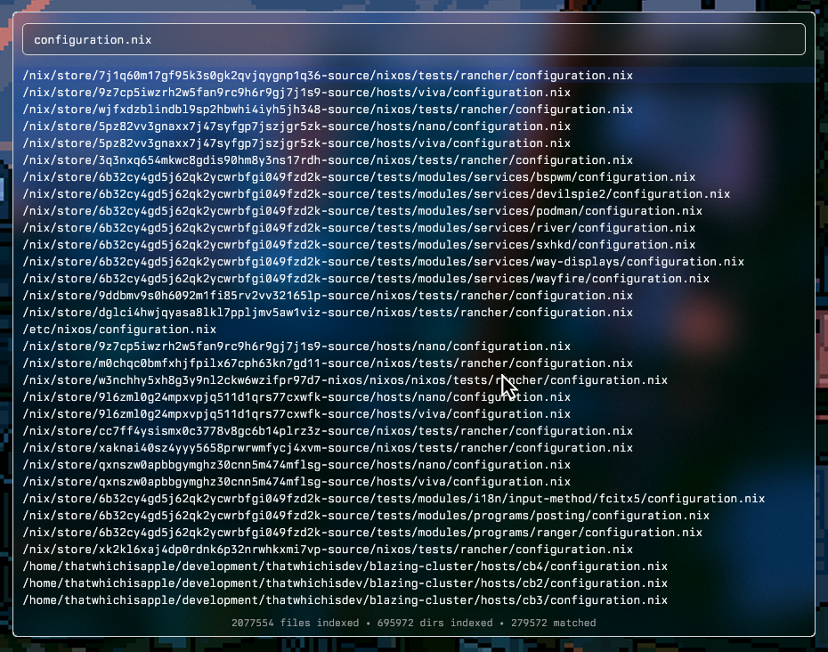
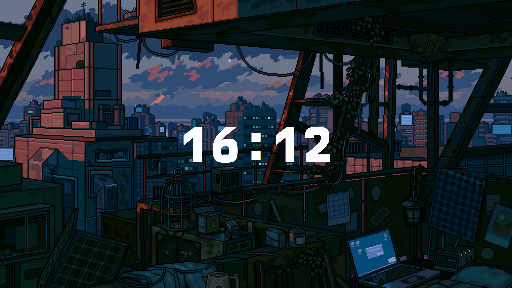

# Preview


# Overview

Ghost Shell is a desktop shell built exclusively for the Niri Wayland
compositor. It is built on top of Zed's GPUI UI framework.

The philosophy behind the project is dead simple: be efficient, provide the
necessary tooling, stay simple where possible, and delegate whatever makes sense
to the compositor.

The project's name is inspired by the anime Ghost in the Shell.

## Bar

The bar follows a widely adopted layout with three sections: start, center, and
end. You can place the widgets you want in each section through configuration.



## Launcher

The application launcher is intentionally simple. It displays all applications
discovered on the system and allows you to launch them through Niri's `spawn`
command. Terminal applications are launched inside a terminal emulator.



## Finder

The file and directory finder is one of the ideas I'm particularly proud of. It
takes advantage of the `fff` library to build an indexed tree of files and
directories, allowing Ghost Shell to quickly find files across the system.



## Lockscreen

The lockscreen supports animated wallpapers. What else do you need?



# Roadmap

The project is still in a very early alpha stage. I don't expect a release any
time soon. There is still a lot to implement, test, and improve before I can be
confident that Ghost Shell is robust and performant enough for a proper release.

- [ ] Bar
  - [ ] Widget: System Menu
  - [x] Widget: Niri Workspaces
  - [x] Widget: Focused Window
  - [ ] Widget: Tray
  - [ ] Widget: Notifications
  - [ ] Widget: Camera
  - [ ] Widget: Audio Control (Speakers/Microphone)
  - [ ] Widget: Bluetooth Control
  - [ ] Widget: Network Control (Wi-Fi/Ethernet)
  - [ ] Widget: Power Control (Battery/Power modes)
  - [x] Widget: Clock
  - [ ] Widget: Screenshot & Screen recording
  - [ ] Widget: Theme Polarity Changer
  - [ ] Widget: Weather
- [x] Launcher
- [x] Finder
- [x] Lock Screen
- [ ] Clipboard
- [ ] Wallpapers
- [ ] Theming

# Getting Started

## Prerequisites

- Rust nightly
- Niri Wayland compositor
- GPUI's [necessary system
  libraries](https://github.com/zed-industries/zed/blob/main/docs/src/development/linux.md)

If you're using Nix, the following command will provide the Rust toolchain and
system libraries needed to build the project:

```shell
nix develop
```

## Installation

Clone the repository:

```shell
git clone https://github.com/thatwhichisdev/ghost-shell
```

## Building

```
cargo build  
```

## Running

```
cargo run   
```

## Configuration

Ghost Shell follows the XDG Base Directory Specification when discovering its
configuration.

A simple `~/.config/ghost-shell/config.toml` configuration can look like:

```toml
[general]
font_family = "BerkeleyMono Nerd Font Mono"
font_size = 13
fg = 0xffffffff
bg = 0x00000000

[bar."eDP-1"]
output = "eDP-1"
height = 27.0
exclusive_zone = 27.0

[bar."DP-1"]
primary = true
output = "DP-1"
height = 27.0
exclusive_zone = 27.0

[clock]
format = "%H:%M"

[wallpaper]
bg = 0x00000000
path = "/nix/store/i1a32bnx94ynzfx7wq052fz6ybbak95n-source/assets/wallpapers/motion/waneella_clouds.gif"
```

# Acknowledgments

Ghost Shell would not be possible without the excellent work of the projects it
builds upon:

- [niri](https://github.com/niri-wm/niri) - the backbone of the project and my
  favorite Wayland compositor. It provides a lot of functionality Ghost Shell
  can rely on, such as spawning applications, streaming compositor state, and
  much more.
- [gpui](https://gpui.rs/) - Zed's GPU-accelerated UI framework. Fast,
  expressive, and genuinely enjoyable to build native interfaces with.
- [gpui-component](https://github.com/longbridge/gpui-component) — a
  comprehensive component library for GPUI that provides most of the building
  blocks needed to get a polished interface running quickly.
- [awww](https://codeberg.org/LGFae/awww) - an excellent animated wallpaper
  daemon that introduced me to one of my favorite animated wallpapers. It has
  also been a great project to learn from while building Ghost Shell's own
  animated wallpaper renderer.
- [fff](https://github.com/dmtrKovalenko/fff) - amazing file search toolkit,
  powers finder and launcher's applications filtering.

# Licensing

The code in this project is licensed under the MIT License. Check the
[LICENSE](LICENSE.md) file for further details.
