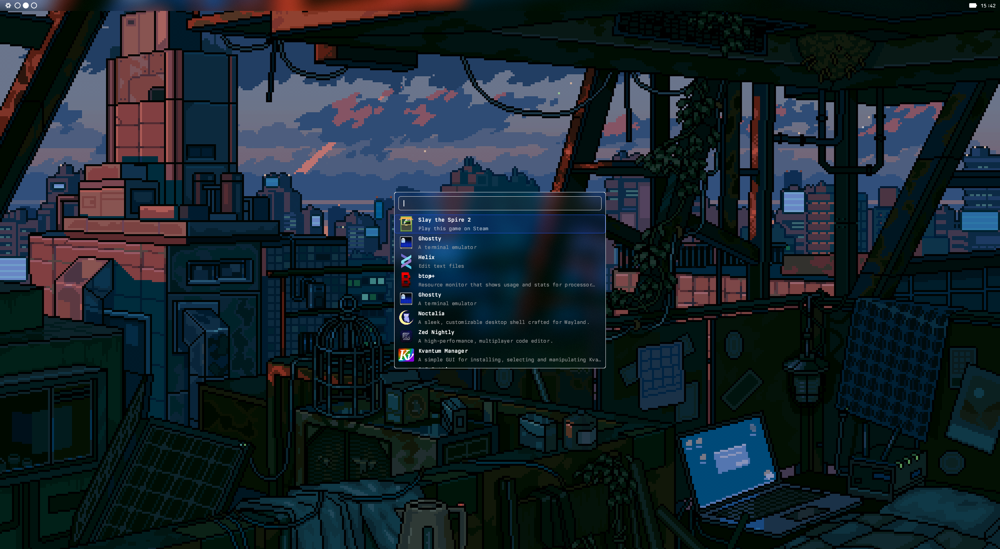
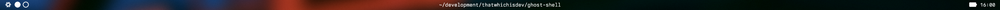
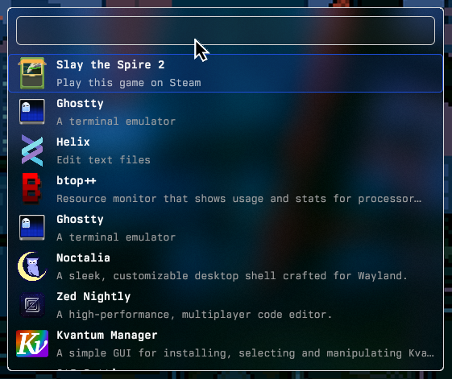
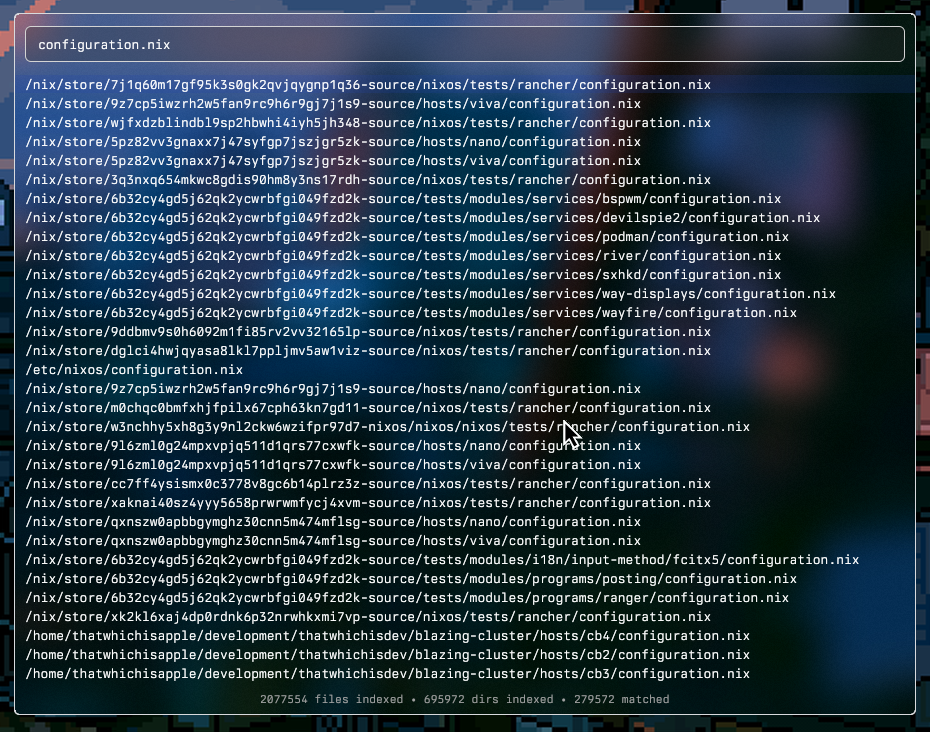
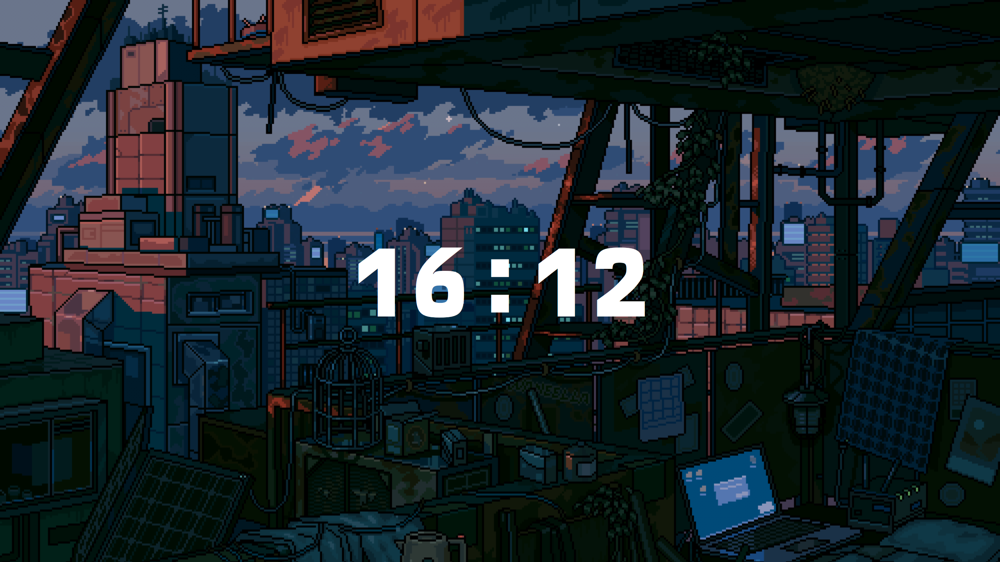

# Ghost Shell

A desktop shell for the Niri Wayland compositor, built with GPUI.

[User documentation](wiki/README.md) · [Contributing](CONTRIBUTING.md) ·
[Agent guide](AGENTS.md)

## Preview

## Overview

Ghost Shell is a desktop shell built exclusively for the Niri Wayland
compositor. It is built on top of Zed's GPUI UI framework.

The philosophy behind the project is dead simple: be efficient, provide the
necessary tooling, stay simple where possible, and delegate whatever makes sense
to the compositor.

The project's name is inspired by the anime Ghost in the Shell.

### Bar

The bar follows a widely adopted layout with three sections: start, center, and
end. Its current widget layout is fixed; appearance and outputs are configurable.
See the [bar guide](wiki/Bar.md) and [widget reference](wiki/Widgets.md).

### Launcher

The application launcher is intentionally simple. It displays all applications
discovered on the system and allows you to launch them through Niri's `spawn`
command. Terminal applications are launched inside a terminal emulator.

### Finder

The file and directory finder is one of the ideas I'm particularly proud of. It
takes advantage of the `fff` library to build an indexed tree of files and
directories, allowing Ghost Shell to quickly find files across the system.

### Lockscreen

The lockscreen supports animated wallpapers. What else do you need?

## Roadmap

The project is still in a very early alpha stage. I don't expect a release any
time soon. There is still a lot to implement, test, and improve before I can be
confident that Ghost Shell is robust and performant enough for a proper release.

- [ ] Bar
  - [ ] Widget: System Menu
  - [x] Widget: Niri Workspaces
  - [x] Widget: Focused Window
  - [ ] Widget: Tray
  - [ ] Widget: Notifications
  - [ ] Widget: Camera
  - [ ] Widget: Audio Control (Speakers/Microphone)
  - [ ] Widget: Bluetooth Control
  - [ ] Widget: Network Control (Wi-Fi/Ethernet)
  - [ ] Widget: Power Control (Battery/Power modes)
  - [x] Widget: Clock
  - [ ] Widget: Screenshot & Screen recording
  - [ ] Widget: Theme Polarity Changer
  - [ ] Widget: Weather
- [x] Launcher
- [x] Finder
- [x] Lock Screen
- [ ] Clipboard
- [ ] Wallpapers
- [ ] Theming

## Documentation

Start with the [wiki](wiki/README.md) for the project overview and user guides:

- [Installation](wiki/Installation.md) and [getting started](wiki/Getting-Started.md)
- [Configuration](wiki/Configuration.md) and [theming](wiki/Theming.md)
- [Bar](wiki/Bar.md) and [individual widgets](wiki/Widgets.md)
- [Launcher](wiki/Launcher.md), [finder](wiki/Finder.md), and
  [lockscreen](wiki/Lockscreen.md)
- [Wallpapers](wiki/Wallpapers.md) and [CLI commands](wiki/Commands.md)
- [Architecture](wiki/Architecture.md) and
  [troubleshooting](wiki/Troubleshooting.md)

Build, run, and contribution instructions live in [CONTRIBUTING.md](CONTRIBUTING.md).
The roadmap above tracks completion; implemented features may still have alpha
limitations documented in their respective guides.

## Acknowledgments

Ghost Shell would not be possible without the excellent work of the projects it
builds upon:

- [niri](https://github.com/niri-wm/niri) - the backbone of the project and my
  favorite Wayland compositor. It provides a lot of functionality Ghost Shell
  can rely on, such as spawning applications, streaming compositor state, and
  much more.
- [gpui](https://gpui.rs/) - Zed's GPU-accelerated UI framework. Fast,
  expressive, and genuinely enjoyable to build native interfaces with.
- [gpui-component](https://github.com/longbridge/gpui-component) — a
  comprehensive component library for GPUI that provides most of the building
  blocks needed to get a polished interface running quickly.
- [awww](https://codeberg.org/LGFae/awww) - an excellent animated wallpaper
  daemon that introduced me to one of my favorite animated wallpapers. It has
  also been a great project to learn from while building Ghost Shell's own
  animated wallpaper renderer.
- [fff](https://github.com/dmtrKovalenko/fff) - amazing file search toolkit,
  powers finder and launcher's applications filtering.

## Licensing

See [LICENSE.md](../LICENSE.md) for the project license. Vendored code and assets
also carry their own licenses and attribution notices; see the
[development guide](CONTRIBUTING.md#vendored-code-and-attribution).
