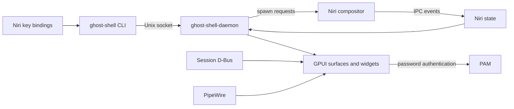

# Architecture

[Wiki](README.md) · [Contributing](../CONTRIBUTING.md)

Ghost Shell separates desktop UI, compositor integration, and shared services
into a Rust workspace. Niri manages windows and workspaces; Ghost Shell consumes
its state and asks it to perform actions such as spawning applications.

## Processes and data flow

The CLI is a short-lived client of the daemon's Unix socket. The daemon owns the
GPUI application, loads configuration, and initializes shared services and UI
surfaces. Its startup order is visible in the
[entry point](../../crates/ghost-shell-daemon/src/main.rs): Tokio and components,
configuration and theme, D-Bus/Niri/IPC, output state, then wallpaper, lockscreen,
launcher, finder, and bar.

## Crate responsibilities

| Crate or group | Responsibility |
| --- | --- |
| `ghost-shell-daemon` | Startup and application lifetime |
| `ghost-shell-cli`, `ghost-shell-ipc` | User commands, socket transport, request handling |
| `ghost-shell-app` | Connected displays and focused/primary output selection |
| `ghost-shell-config`, `ghost-shell-theme` | TOML configuration and shared visual styles |
| `ghost-shell-niri` | Compositor IPC client, event stream, and observed state |
| `ghost-shell-dbus` | Status notifier integration and notification service scaffolding |
| `ghost-shell-audio` | PipeWire connection and audio endpoint state |
| `ghost-shell-bar` | Output-specific layer surfaces and widget layout |
| `ghost-shell-launcher`, `ghost-shell-finder` | Search windows and their behavior |
| `ghost-shell-wallpaper`, `ghost-shell-lockscreen` | Background rendering and session locking |
| `ghost-shell-widgets/*` | Individual bar views |
| `ghost-shell-components/*` | Shared UI controls and root views |
| `ghost-shell-gpui`, `ghost-shell-gpui-macros` | Vendored UI framework and macros |
| `ghost-shell-tokio` | Integration between GPUI and asynchronous service work |
| `ghost-shell-assets`, `ghost-shell-actions`, `ghost-shell-util` | Embedded resources and shared primitives |

## State and surfaces

GPUI entities and globals hold application state. Observers propagate changes to
views; services perform asynchronous work through the Tokio integration. The
[agent guide](../../AGENTS.md#gpui) describes the entity and context conventions.

The bar manager reconciles configured outputs against connected displays. It
shares menu, focus, tray, audio, power, and clock entities across bars, while
creating a workspace entity for each output. Configuration is loaded once at
startup; display reconciliation is not configuration hot reload.

Wallpaper management also tracks display changes. Launcher and finder choose
the focused output when available, then fall back to the primary display.
The lockscreen uses session-lock handling rather than a normal launcher window.

## Extension points

Widgets are compiled Rust crates, not runtime plugins. Adding one currently
requires its implementation, workspace dependencies, bar initialization, and
layout integration. Add user options to `ghost-shell-config` only when behavior
actually consumes them, then document them in the [widget reference](Widgets.md).
Reusable controls belong in the component crates.
